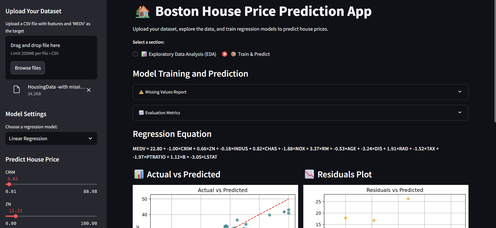

# 🏡 Boston House Price Predictor

This project provides an end-to-end solution for **predicting house prices** using the **Boston Housing dataset**. It includes:

- A well-documented **Jupyter Notebook** (`Boston House Predictor.ipynb`) for data analysis and modeling
- An interactive **Streamlit app** (`streamlit_app (2).py`) to visualize results and make live predictions

---

## 📘 Problem Statement

The objective is to predict the **median value of owner-occupied homes (`MEDV`)** in Boston suburbs based on various explanatory features like crime rate, number of rooms, and more.

---

---

## 📓 Jupyter Notebook Overview

`Boston House Predictor.ipynb` covers:

### 📊 EDA (Exploratory Data Analysis)
- Dataset preview and structure
- Descriptive statistics
- Correlation heatmap
- Histogram of target (`MEDV`)
- Feature-wise scatter plots against `MEDV`

### 🧹 Preprocessing
- Handling missing values
- Feature scaling with `StandardScaler`
- Train/test split

### 🤖 Model Building
- Supports:
  - **Linear Regression**
  - **Ridge Regression**
  - **Lasso Regression**
- Evaluation Metrics:
  - Mean Absolute Error (MAE)
  - Root Mean Squared Error (RMSE)
  - R² Score and Adjusted R²

### 📈 Visuals
- Actual vs Predicted
- Residual plots
- Feature importance

---

## 🌐 Streamlit Web App

Launch the app using `streamlit_app (2).py` to:

- Upload your CSV file
- Explore the data interactively
- Train & tune regression models (Linear, Ridge, Lasso)
- Use sliders to predict price based on custom input
- View model performance metrics and visualizations
- Download predictions as CSV

  ---

## 📸 Streamlit App Preview

---

##  Author

**Firdose**  
📎 [LinkedIn](https://www.linkedin.com/in/firdose-anjum-ml/) • 💼 [Portfolio](https://firdoseanjum.framer.website/)
